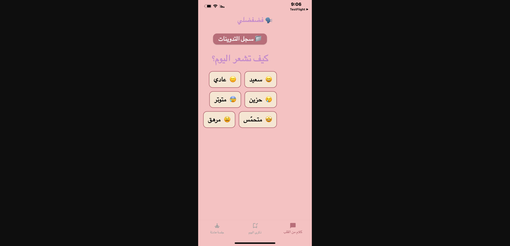
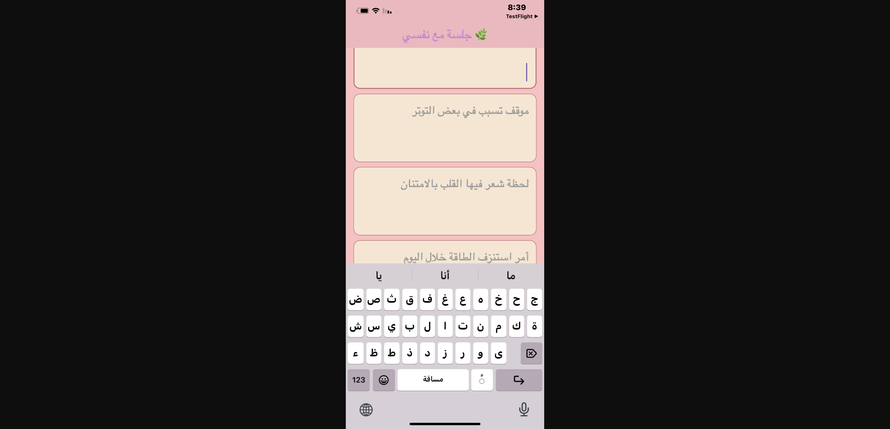
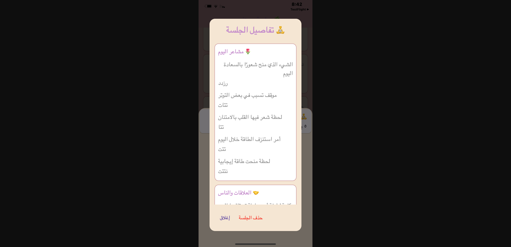
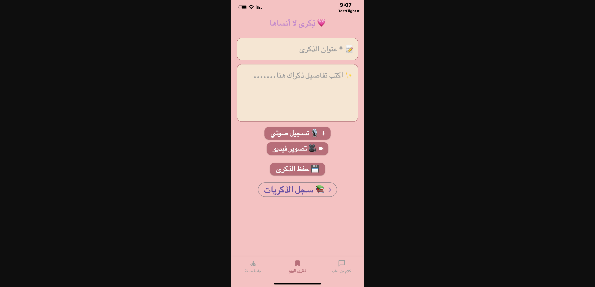

# 🌟 Memories App - لحظات ذكرى# lahzet_zikry


<div align="center">دفتر إلكتروني عربي لتسجيل الذكريات والمذكرات اليومية


## Getting Started


**A beautiful and intuitive iOS app for capturing and preserving your precious memories**This project is a starting point for a Flutter application.


[](https://flutter.dev)A few resources to get you started if this is your first Flutter project:

[](https://www.apple.com/ios)

[](https://github.com/Zeyad97/Memories-App-Flutter)- [Lab: Write your first Flutter app](https://docs.flutter.dev/get-started/codelab)

[](LICENSE)- [Cookbook: Useful Flutter samples](https://docs.flutter.dev/cookbook)


</div>For help getting started with Flutter development, view the

[online documentation](https://docs.flutter.dev/), which offers tutorials,

---samples, guidance on mobile development, and a full API reference.


## 📱 Overview

Memories App (لحظات ذكرى) is a personal memory journal that helps you capture, organize, and cherish your life's special moments. With a stunning space-themed interface featuring animated stars and shooting stars, the app provides a serene environment for documenting your thoughts, photos, and videos.

## ✨ Features

### 🎨 Beautiful UI
- **Space-Themed Design**: Immersive dark theme with animated stars and shooting stars
- **Smooth Animations**: Fluid transitions and engaging visual effects
- **RTL Support**: Full support for Arabic language (Right-to-Left)

### 📝 Memory Management
- **Write Memories**: Document your thoughts and experiences with rich text
- **Attach Media**: Add photos and videos to your memories
- **Edit Memories**: Update titles and content anytime
- **Organize**: Browse and search through all your saved memories

### 📸 Instagram-Style Studio
- **Media Gallery**: View all your photos and videos in a beautiful 3-column grid
- **Grid & List View**: Toggle between different viewing modes
- **Standalone Media**: Add media that stays in the studio until attached to a memory
- **Full-Screen Viewer**: View media with play/pause controls for videos
- **Add to Memory**: Easily attach studio media to existing memories

### 🔒 Security & Privacy
- **PIN Protection**: Secure your memories with a 4-digit PIN
- **Biometric Auth**: Support for Face ID and Touch ID
- **Security Questions**: Recover access with security questions
- **Local Storage**: All data stored locally on your device

### 🎯 Smart Organization
- **Filter Memories**: Filter by titled, untitled, with media, or text-only
- **Search**: Quick search through titles and content
- **Date Sorting**: Memories automatically sorted by date
- **Pull to Refresh**: Easy refresh functionality

## 🖼️ Screenshots

<div align="center">
  
  
  
  
</div>

## 🚀 Getting Started

### Prerequisites

- Flutter SDK (3.0 or higher)
- Dart SDK (3.0 or higher)
- Xcode 14+ (for iOS development)
- iOS device or simulator (iOS 12.0+)

### Installation

1. **Clone the repository**
   ```bash
   git clone https://github.com/Zeyad97/Memories-App-Flutter.git
   cd Memories-App-Flutter
   ```

2. **Install dependencies**
   ```bash
   flutter pub get
   ```

3. **Run the app**
   ```bash
   flutter run
   ```

### Building for Release

**iOS Release Build:**
```bash
flutter build ios --release
```

Then open in Xcode for archiving:
```bash
open ios/Runner.xcworkspace
```

## 📦 Dependencies

- **flutter_localizations**: Localization support
- **local_auth**: Biometric authentication
- **shared_preferences**: Local data storage
- **image_picker**: Photo and video selection
- **video_player**: Video playback
- **path_provider**: File system access
- **permission_handler**: App permissions
- **flutter_local_notifications**: Notification scheduling
- **intl**: Date formatting
- **fluttertoast**: Toast messages

## 🏗️ Architecture

```
lib/
├── main.dart                      # App entry point
├── splash_screen.dart             # Initial splash screen
├── splash_page.dart               # Animated splash
├── pin_page.dart                  # PIN authentication
├── register_page.dart             # First-time setup
├── security_questions.dart        # Security Q&A
├── reset_pin_page.dart           # PIN recovery
├── verify_security.dart          # Security verification
├── home_page.dart                # Main navigation
├── memories_browser_page.dart    # Writing interface
├── memory_page.dart              # Media studio (Instagram-style)
├── memories_list_page.dart       # Browse & edit memories
├── memory_details_page.dart      # View/edit single memory
├── notification_service.dart     # Notification handling
└── fdfd_page.dart               # Settings/preferences
```

## 🎨 Design System

### Color Palette
- **Space Black**: `#0A0A0F` - Primary background
- **Dark Gray**: `#1A1A1F` - Secondary background
- **Medium Gray**: `#2A2A2F` - Containers
- **Light Gray**: `#4A4A4F` - Borders
- **Star White**: `#E8E8E8` - Text and icons
- **Text Field Gray**: `#E0E0E0` - Input backgrounds

### Typography
- **Font Family**: Tajawal (Arabic-optimized)
- **Weights**: Regular, Bold
- **Sizes**: 12sp - 24sp

## 📱 Key Components

### 1. Memory Browser (فضاء الذكريات)
Write-only interface for creating new text memories with a clean, distraction-free design.

### 2. Studio (استديو)
Instagram-inspired media gallery with:
- 3-column grid layout
- List view option
- Standalone media management
- Full-screen media viewer
- Add to memory functionality

### 3. Menu (القائمة)
Comprehensive memory browser with:
- Search and filter
- Edit capabilities
- Memory details view
- Media attachment

## 🔐 Security Features

1. **PIN Authentication**: 4-digit PIN protection
2. **Biometric Auth**: Face ID / Touch ID support
3. **Security Questions**: Fallback recovery method
4. **Local Storage**: All data stays on device
5. **No Cloud Sync**: Complete privacy

## 📝 Data Storage

The app uses SharedPreferences for local data storage:

```dart
{
  "memories": [
    {
      "id": "timestamp",
      "title": "Memory Title",
      "createdAt": "ISO8601 date",
      "pages": [
        {
          "text": "Memory content",
          "image": "local_path",
          "video": "local_path"
        }
      ]
    }
  ],
  "standalone_media": [
    {
      "id": "timestamp",
      "type": "image|video",
      "path": "local_path",
      "createdAt": "ISO8601 date"
    }
  ]
}
```

## 🌟 Key Features Explained

### Standalone Media System
Media added in the Studio is saved separately and doesn't create a memory entry until explicitly attached. This prevents clutter in your memories list.

### Edit Mode
Memories can be edited by tapping the edit icon in the detail view. Text fields change to light backgrounds with dark text for better visibility.

### Smart Filtering
- **All**: Show all memories
- **Titled**: Only memories with titles
- **Untitled**: Memories without titles
- **With Media**: Memories containing photos/videos
- **Text Only**: Text-only memories

## 🤝 Contributing

Contributions are welcome! Please feel free to submit a Pull Request.

1. Fork the project
2. Create your feature branch (`git checkout -b feature/AmazingFeature`)
3. Commit your changes (`git commit -m 'Add some AmazingFeature'`)
4. Push to the branch (`git push origin feature/AmazingFeature`)
5. Open a Pull Request

## 📄 License

This project is licensed under the MIT License - see the [LICENSE](LICENSE) file for details.

## 👨‍💻 Developer

**Zeyad Abdelwahab**
- GitHub: [@Zeyad97](https://github.com/Zeyad97)

## 📧 Support

For support, email zeyadabdelwahab@example.com or open an issue on GitHub.

## 🙏 Acknowledgments

- Flutter team for the amazing framework
- All open-source contributors
- Community feedback and support

---

<div align="center">

**Made with ❤️ using Flutter**

⭐ Star this repo if you like it!

</div>
